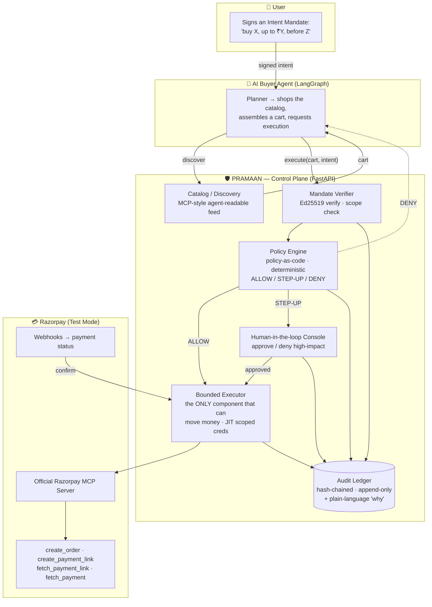
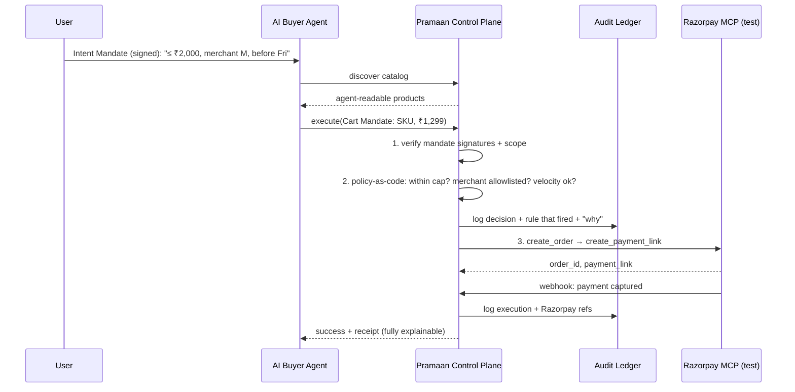

# Pramaan — A Governance & Control Plane for Agentic Commerce

> *Pramaan* (प्रमाण) — Sanskrit/Hindi for **proof, evidence, authority**. The whole system exists to produce verifiable proof and an audit-grade evidence trail for every rupee an AI agent moves. Rename freely; the name is not the point.

**Razorpay AI Buildathon 2026 — Track 01: AI Growth & Agentic Commerce**

**One-line pitch:** *Pramaan makes any Razorpay merchant safely transactable by an autonomous AI buyer — a trust-and-control plane where every money action is bounded by a signed mandate, gated by policy-as-code, executed only through Razorpay's own APIs, and written to a tamper-evident audit ledger. Then we let a rogue agent loose and watch it get caught.*

---

## 1. Why this wins the track

Track 01's brief is literally *"make a merchant transactable by an AI buyer end to end"* and its bar is *"Every money action explainable, bounded and gated. Show the audit trail and one failure handled gracefully."* Most submissions will build the **happy path**: an agent that chats and completes a purchase. That is the easy 80%.

Pramaan builds the **hard, unsolved 20%** that the bar is actually asking for — the trust layer that keeps a rogue, manipulated, or hallucinating agent from moving money it shouldn't. This is not a hackathon abstraction; it is the exact problem the entire industry is racing to solve right now:

- **Razorpay itself** frames its agentic-payments product around *"with great autonomy comes a greater need for security"* and is building agent studios, autonomous purchase agents, and voice payments (Sprint 2026, "The Age of AI-Native Payments").
- **NPCI's Unified Agent Protocol (UAP)** is a national trust layer that registers, verifies, and authorizes AI agents *above* UPI — spending limits, consent, reviewability. Pramaan is a student-scale version of that idea.
- **Google's AP2**, **OWASP's Top 10 for Agentic Applications (2026)**, and the EU AI Act (enforcement Aug 2026) all converge on the same primitives: signed intent, bounded authority, human-in-the-loop for high-impact actions, tamper-evident audit.

**Your unfair advantage:** your Aurionpro internship was a governed multi-agent orchestration layer (Orchestrator → Specialist-Agent → MCP/Tool-Adapter) preserving maker-checker, RBAC, and full audit trails for enterprise transaction banking. Pramaan is that exact pattern, re-pointed at agentic commerce. You are not learning this architecture for the buildathon — you can credibly say you have already shipped it in production for a bank.

---

## 2. What it aligns with (say this in the pitch)

| Real-world thing | How Pramaan reflects it |
|---|---|
| **Razorpay MCP Server** (`mcp.razorpay.com/mcp`, 35+ tools, `READ_ONLY` mode, toolset scoping) | Pramaan's executor calls Razorpay **only** through this official server, in test mode — building *with* Razorpay's infra, not around it. |
| **Razorpay Agentic Payments** (UPI links, Reserve Pay mandates, webhook verification, no PII storage, PCI-DSS) | Pramaan mirrors the trust-and-safety framing and uses UPI payment links + webhook confirmation. |
| **NPCI UAP** (register/verify/authorize agents, spend limits, consent above UPI) | Pramaan's mandate + policy layer is a merchant-side analogue of UAP's agent-authorization concept. |
| **Google AP2** (Intent → Cart → Payment mandates as signed, tamper-evident credentials → non-repudiable audit chain) | Pramaan implements a lightweight AP2-style mandate chain with real Ed25519 signatures. |
| **OWASP Agentic Top 10 (2026)** — excessive agency, tool boundaries in infra not prompts, HITL for high-impact actions, tamper-evident logs | Each is a named, testable control in Pramaan (see §6). |

---

## 3. System architecture



**The one rule that makes it enterprise-grade:** money can only move through the **Bounded Executor**, and the Executor refuses to act unless it holds (a) a mandate that cryptographically verifies and (b) an `ALLOW` (or human-approved `STEP-UP`) verdict from the Policy Engine. Guardrails live in **code and infrastructure**, never in a system prompt — because prompt-level guardrails can be talked around, and OWASP 2026 calls that out explicitly.

---

## 4. The end-to-end flow (happy path)



---

## 5. Components (build spec)

### 5.1 AI Buyer Agent — *the counterparty, kept deliberately simple*
- LangGraph graph with a **Planner** node (reads intent, shops catalog, assembles a cart) and an **Executor-request** node (calls Pramaan). Planner/Executor separation is itself an OWASP-aligned pattern.
- LLM: Gemini (your stack) or a local model via Ollama.
- It holds a **user-signed Intent Mandate** and cannot exceed its scope without re-prompting.
- *Why simple:* the buyer is not the star. The control plane is. But you need a real buyer to demo the loop — and to attack in §7.

### 5.2 Catalog / Discovery — *agent-readable merchant*
- A small MCP-style server (or plain REST + a machine-readable JSON schema) exposing one merchant's products: id, title, price, terms, refund policy.
- This is the "make a merchant transactable by an AI buyer" half of the brief.

### 5.3 Mandate Verifier — *authorization, AP2-style*
- Two mandate types, each a signed JSON object (lightweight stand-in for AP2's W3C Verifiable Credentials):
  - **Intent Mandate** — signed by the *user key*. Captures scope: max amount, merchant allowlist, category, expiry, human-present flag.
  - **Cart Mandate** — signed by the *merchant key*. Binds exact SKU + price + tax + total to the intent.
- Verify with **Ed25519** (`pynacl` or `cryptography`). Reject on bad signature, expired mandate, or cart that exceeds intent scope. This gives you *real* tamper-evidence, not hand-waving.
- A **Payment Mandate** (derived, references order) can be a stretch goal to fully mirror AP2's three-mandate chain.

### 5.4 Policy Engine — *the guardrail, as code*
- **Deterministic** rules evaluated by pure Python functions over a declarative policy file (YAML/JSON). No LLM in the decision path — decisions must be reproducible and testable.
- Rules to ship: per-transaction spend cap, cumulative/velocity cap (rate limiting → OWASP runaway-loop mitigation), merchant allowlist, category rules, mandate-expiry, business-hours / amount-threshold → **STEP-UP** to human.
- Output: `ALLOW` | `STEP_UP` | `DENY`, **always with the specific rule that fired** and a human-readable reason.
- This is your maker-checker + RBAC + least-privilege, reframed for agents.

### 5.5 Bounded Executor — *the only thing that can move money*
- Wraps the **official Razorpay MCP server** (test mode): `create_order`, `create_payment_link`, `fetch_payment_link`, `fetch_payment`, `capture_payment`. (`initiate_payment`, the S2S UPI API, 404s on standard test accounts — it needs separate Razorpay approval — so the automated demo path uses a payment link and fetches its status rather than a synchronously-completed payment.)
- **Read-only by default;** write/money actions require a passing verdict. Uses a **just-in-time, scoped credential** per transaction (short-lived, single-purpose) — the least-privilege pattern from the enterprise playbooks.
- Idempotency keys so a retry can never double-charge.
- Listens to Razorpay **webhooks** to confirm final status (closes the loop the way Razorpay's own agentic product does).

### 5.6 Audit Ledger — *the evidence*
- Postgres, **append-only**, **hash-chained**: each row stores `hash(prev_row_hash + payload)` → tamper-evident, EU-AI-Act-style lineage, AP2-style non-repudiable chain.
- Every mandate check, policy verdict, human decision, and Razorpay call is a row: `agent_id`, `mandate_ids`, `verdict`, `rule_fired`, `razorpay_refs`, `plain_language_explanation`, `timestamp`, `prev_hash`, `row_hash`.
- One API: *"explain transaction T"* → reconstructs the full story in plain English. This **is** the "explainable + audit trail" bar, delivered literally.

### 5.7 Human-in-the-loop Console + Dashboard — *legibility for judges*
- Next.js (your stack). Panels: live transaction feed, policy verdicts with the rule that fired, the audit ledger with an **"Explain"** button, a **STEP-UP approval queue**, and a red **"Rogue agent blocked"** panel.
- HITL shows the reviewer the mandate + the reason — *not a rubber stamp* (OWASP's warning), a real decision surface.

---

## 6. Enterprise controls → where each one lives

| Control (from OWASP 2026 / AP2 / enterprise practice) | Where it lives in Pramaan |
|---|---|
| **Excessive-agency mitigation** (agent can't do more than the task needs) | Executor is read-only by default; every write gated by mandate + policy |
| **Tool boundaries enforced in infra, not prompts** | Policy Engine is deterministic code; Executor is the sole money path |
| **Least privilege / JIT scoped credentials** | Per-transaction short-lived credential; toolset scoping on the MCP server |
| **Rate limiting / runaway-loop protection** | Velocity caps in the Policy Engine |
| **Verifiable intent, tamper-evidence** | Ed25519-signed Intent + Cart mandates |
| **Human-in-the-loop for high-impact actions** | `STEP_UP` verdict → approval console |
| **Non-repudiable, lineage-backed audit** | Hash-chained append-only ledger + explainability API |

Being able to point at this table in your pitch is what separates "I built a checkout bot" from "I built a governance plane that maps to the actual 2026 standards."

---

## 7. The demo that wins the room — one failure, handled gracefully

Scripted, and the literal thing the bar asks for. Run a **rogue / prompt-injected buyer agent** through three attacks; the control plane catches each, blocks the money, routes or safe-declines, and logs everything:

1. **Over-mandate spend** — agent tries ₹5,000 on a ₹2,000 intent → Policy Engine `DENY (per_transaction_cap)`, no money moves, ledger row written.
2. **Off-allowlist merchant / goal hijack** — injected instruction redirects payment to an unknown payee → `DENY (merchant_allowlist)`.
3. **Tampered cart / replay** — cart price altered after signing, or a mandate replayed → Mandate Verifier fails the signature/nonce → blocked.

Then run a **legitimate** purchase. Honestly: the canonical ₹1,299 tea purchase is *above* the ₹1,000 STEP_UP threshold in `policies/rules.yaml`, so it does not auto-execute — it correctly returns `STEP_UP` and waits for a human, which is itself the demo of the HITL control in §5.7/§6. A second, cheaper legitimate cart (e.g. ₹500, under the threshold) auto-`ALLOW`s and completes on Razorpay test mode end to end. Showing both — one human-approved, one fully automatic — plus the three blocked attacks is the full contrast: nothing slips past the gate, and the gate isn't just a blunt no.

**Honest metrics to report (this is the "evidence" the bar wants):** run a batch of ~30–50 synthetic buyer attempts (mix of legitimate + malicious). Report money moved vs money blocked, and the guard's **false-positive cost** (legit purchases wrongly blocked). One caught attack is a demo; a measured batch with an honest false-positive number is proof.

---

## 8. Tech stack (chosen for your skills + Claude Code buildability)

| Layer | Choice | Why |
|---|---|---|
| Control plane API | **Python + FastAPI** | Your stack; fast to build; clean for a policy/ledger service |
| Agent orchestration | **LangGraph** | Your stack; gives clean Planner/Executor separation |
| LLM | **Gemini** (or Ollama local) | Your stack; local model is a nice "runs offline" flex |
| Mandates / crypto | **Ed25519** via `pynacl` / `cryptography` | Real signatures, tiny surface, demoable tamper-evidence |
| Policy-as-code | **Pure Python + YAML rules** | Deterministic, unit-testable; skip OPA/Rego (overkill here) |
| Audit ledger | **Postgres**, append-only + hash chain | Your stack; tamper-evident without a blockchain |
| Payments | **Official Razorpay MCP server**, test mode | Deep alignment; zero custom payment code |
| Dashboard / HITL | **Next.js + React** | Your stack; makes the 5-min demo legible |
| Observability | Structured logs + a metrics panel | "Honest metrics" + enterprise observability signal |

Everything here is squarely inside what you already do and what Claude Code accelerates well: a FastAPI service, a rules module, a Postgres schema, MCP wiring, and a React dashboard.

---

## 9. Build roadmap (phased so you actually finish)

Build the **spine first, guardrails second, polish last.** Each phase is a working checkpoint.

- **Phase 0 — Spine (money moves once).** FastAPI skeleton + Postgres. Wire the Razorpay MCP server in test mode. Get one `create_order → create_payment_link → fetch_payment_link` working end to end (fetches an actual payment only once one exists). *Checkpoint: a rupee can move in test mode via the link — full automated capture is a Phase 5 rogue-agent-demo concern.*
- **Phase 1 — Mandates.** Intent + Cart schemas; Ed25519 sign/verify; scope check (cart ≤ intent). Buyer agent signs an intent; plane verifies. *Checkpoint: bad signature / over-scope cart is rejected.*
- **Phase 2 — Policy engine.** Deterministic rules (cap, velocity, allowlist, step-up threshold) over a YAML file; `ALLOW/STEP_UP/DENY` + rule-fired. Unit tests. *Checkpoint: verdicts are reproducible and tested.*
- **Phase 3 — Audit ledger.** Hash-chained append-only table; log every check/verdict/call; the *"explain transaction"* API. *Checkpoint: any transaction reconstructs in plain English.*
- **Phase 4 — HITL + dashboard.** Next.js feed, verdicts, approval queue, explain view. *Checkpoint: a human can approve a STEP-UP and it's logged.*
- **Phase 5 — Rogue-agent demo + metrics.** Scripted attacks; synthetic batch; metrics panel (moved vs blocked, false-positive rate). *Checkpoint: the 5-min story runs start to finish.*

If time runs short, **Phases 0–3 + the rogue demo** are a complete, defensible submission on their own. Phase 4–5 polish raises the ceiling.

---

## 10. Scope discipline (what to cut)

The bar punishes sprawl and cherry-picking. Depth over breadth:

- **One** merchant, **one** product category, **one** buyer flow (UPI payment link, test mode). Do not build a marketplace.
- **Simulate honestly** where you must and *say so*: a lightweight signed-JSON mandate instead of the full W3C VC stack; no real x402/stablecoin settlement (name it as a future direction). Honesty about stubs is rewarded; fake completeness is punished.
- Don't gold-plate the buyer agent. It exists to be governed and to be attacked.
- The guardrail must be **airtight** and **every action logged** — that is the whole point. A small system where nothing slips past the gate beats a big system with holes.

---

## 11. How to talk about it (pitch spine, ~5 min)

1. **The problem (30s):** agents are about to move real money on UPI (NPCI UAP, Razorpay agentic payments). The unsolved part isn't the buying — it's stopping a rogue agent from moving money it shouldn't.
2. **The idea (30s):** Pramaan — a control plane that makes a Razorpay merchant transactable by an AI buyer, where every money action is mandate-bound, policy-gated, and audited.
3. **The architecture (90s):** the one rule (money only moves through the gated Executor); mandates (AP2-style); policy-as-code; hash-chained ledger. Show the diagram.
4. **The failure, handled (90s):** the rogue agent tries three attacks, gets caught each time, then a legit purchase completes. Show the dashboard and the "explain" view.
5. **The evidence (30s):** the batch metrics — money blocked, false-positive cost, 100% of actions audited.
6. **Why me (30s):** "I built this exact governed-orchestration pattern in production at Aurionpro for enterprise transaction banking. Here it is for agentic commerce."

---

## 12. Repo structure judges will actually read

```
pramaan/
├── README.md                 # problem → architecture diagram → demo GIF → run steps → metrics
├── ARCHITECTURE.md           # this document
├── control-plane/            # FastAPI: mandate verifier, policy engine, executor, ledger
│   ├── policies/rules.yaml   # policy-as-code (human-readable = judge-readable)
│   └── tests/                # policy unit tests = "honest metrics" credibility
├── buyer-agent/              # LangGraph buyer + the scripted rogue scenarios
├── dashboard/                # Next.js HITL console + live feed + explain view
├── eval/                     # synthetic batch + metrics script (blocked vs allowed, FP cost)
└── docs/                     # sequence diagrams, threat-model → control mapping (the §6 table)
```

A README that opens with the problem, one architecture diagram, a 20-second demo GIF of the rogue agent getting caught, and a metrics table will beat a wall of text every time.

---

*Grounded in: Razorpay MCP Server & Agentic Payments docs, Razorpay Sprint 2026, NPCI Unified Agent Protocol reporting, Google AP2 specification, and the OWASP Top 10 for Agentic Applications (2026). Verify the live API/tool details against Razorpay's docs when you build — they move fast.*
